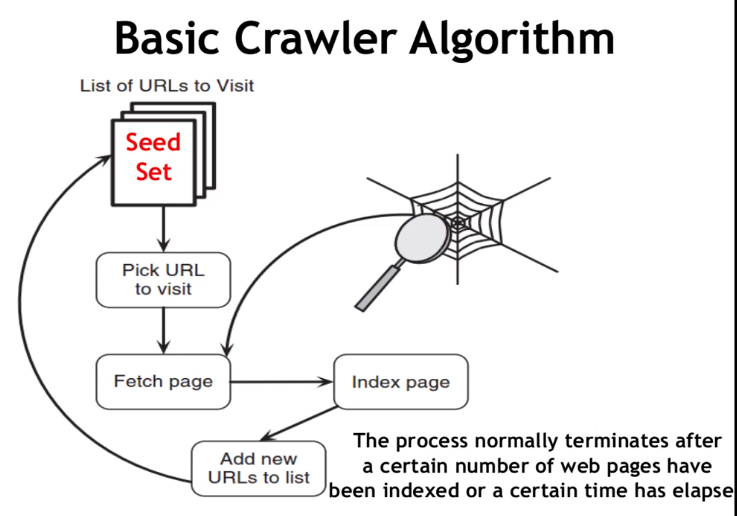

# **<u>Crawler Documentation</u>**

- Goal of the crawler is to output a **HUGE** amount of webpages and downloads them (w/o looking at the content)

****

## **<u>Basic Algorithm</u>**



****

## **<u>Crawler Issues</u>**

- If two documents have different URLs but same content, or nearly the same content
  - Make a function that compares two documents and if two are similar, don't add the second one to the search
- which web pages to visit first ?
  - FIFO
  - If more hyperlinks point to a website, we should visit it first
  - Domains ending in ".com" may have higher priority.
- When to start a new crawl ?
  - New crawl immediately after the current one is finished
- How often should the crawler refresh its pages ?
  - Simple: revisit all pages with same frequency

****

## **<u>Robot Exclusion Protocol</u>**

- Each website has a `robots.txt` file, that has the following structure

  ```
  User-agent: *
  Disallow: /docs
  ```

- Disallow means that we shouldn't visit any urls starting with `/docs` in that website.

### **<u>Robot.txt samples</u>**

```
User-agent: Googlebot-Image
Disallow: /
```

means that this bot shouldn't visit this website at all

****

```
User-agent: *
Disallow: /images/

User-agent: Googlebot-Image
Disallow: /
```

Nobody should visit `/images/`, googlebot shouldn't visit at all

****

## **<u>File Structure</u>**

```
SearchEngine
	|
	 --- Crawler
	 		|
	 		 --- Crawler.java
	 		 --- CrawlerUtils.java
	 		 --- RobotsChecker.java
	 		 --- InitialSeed.txt
```

****

## **<u>Functions and Variables</u>**

### `ReadInitialSeed`

`CrawlerUtils`

```
def ReadInitialSeed(filepath: string):
	input: filename of the textfile with the SEED urls
	outputs: set of urls in the file
```

****

### `CrawlURL`

`Crawler.java`

```
def CrawlURL(url: string):
	input: url of website that was checked for allow/disallow
			i.e. if a url is passed here, we assume that it is allowed and passed all other check
	output: none
	operation: 
			Downloads the document
			Gets all the <a> tags
			Performs checks on tag, if the checks pass, they are added to the Seed Set
```

****

### `StartCrawl`

`Crawler.java`

```
def StartCrawl():
	ReadInitialSeed()
	while SEED.not_empty()
		current_url = SEED.pop()
		Perform checks on url
		If checks pass:
			CheckRobots()
			CrawlURL()
		else:
			continue
		
```

****